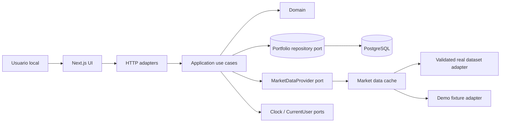
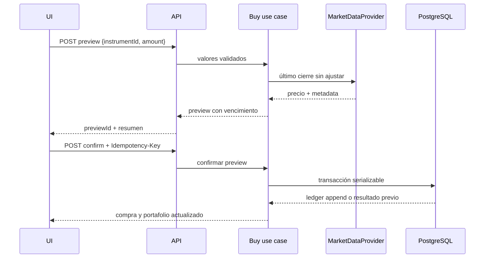

# Arquitectura del sistema

**Estado:** aceptada para iniciar implementación  
**Estilo:** monolito modular con puertos y adapters

## Contexto y componentes

BolsaSim CO se ejecutará localmente como una aplicación Next.js con UI y API HTTP. PostgreSQL conserva el ledger y datos operativos. El mercado se consume exclusivamente mediante `MarketDataProvider`. La autenticación es reemplazada por un `CurrentUserProvider` local durante el MVP.

## Fronteras y dependencias

- `domain`: entidades, value objects, errores, políticas y servicios puros. No depende de framework, ORM, HTTP ni proveedor.
- `application`: casos de uso y puertos para ledger, previews, instrumentos, mercado, reloj e identidad.
- `infrastructure`: Drizzle/PostgreSQL, adapters de mercado, caché y logging. Implementa puertos.
- `presentation`: rutas HTTP, validación de payloads, mapeo de errores, páginas y componentes. No contiene reglas financieras.

Solo las capas externas conocen las internas. Los DTO no sustituyen value objects del dominio. Zod valida la frontera; el dominio vuelve a validar invariantes.

## Flujo de compra

La preview dura cinco minutos, conserva el precio cotizado y se almacena en servidor. Al confirmar, se comprueban vigencia, instrumento, fondos y estado de uso dentro de la misma transacción. La clave idempotente retorna el resultado original ante repetición con el mismo payload y conflicto ante payload diferente.

## Persistencia

PostgreSQL será autoritativo. Tablas conceptuales: users, portfolios, instruments, transactions, buy_previews e idempotency_records. `transactions` es append-only desde la aplicación; un índice único asegura un depósito inicial por portafolio. Saldos y posiciones se calculan desde movimientos; se podrán añadir proyecciones materializadas reconstruibles si las mediciones lo justifican.

La compra usa una transacción con aislamiento suficiente y bloqueo del portafolio para impedir doble gasto. Importes usan `numeric(24,2)` y precios/cantidades `numeric(28,8)`. Los decimales cruzan HTTP como strings.

Las simulaciones históricas no se persisten. Instrumentos pueden sincronizarse desde el manifiesto validado; el ledger conserva una referencia y snapshot mínimo de símbolo/moneda para auditabilidad.

## Flujos de lectura y valoración

El dashboard reproduce movimientos hasta el instante solicitado, agrupa cantidades y costo, obtiene precios por lote a través del puerto y compone una proyección. Un precio faltante marca la posición y el total como incompletos; no se suma cero. La evolución usa el último cierre anterior o igual y expone `priceSessionDate` en cada punto.

Para un split conocido sin política implementada, la posición queda `CORPORATE_ACTION_UNSUPPORTED` desde la fecha efectiva. No se alteran cantidades históricas.

## Datos de mercado y caché

La caché implementa el mismo puerto y envuelve al adapter seleccionado. TTL inicial: cinco minutos para último precio y 24 horas para históricos; archivos se invalidan por checksum. No hay Redis. Un fallo real nunca activa el adapter mock automáticamente.

La fuente real autorizada es un bloqueo de aceptación: debe demostrar
cobertura, cierres diarios, procedencia y permiso de uso. El modo demo sigue
siendo el predeterminado; véanse el ADR-0005 y el plan del Slice 6.

## API, seguridad y confianza

La API sigue OpenAPI 3.1. Cada respuesta incluye `X-Request-Id`; errores adoptan un objeto Problem estable. La UI envía intención, nunca precio, cantidad resultante, saldo o P&L autoritativos. Validación de payload, límites de longitud, consultas parametrizadas y secretos solo en servidor.

El MVP escucha localmente. Si se despliega públicamente, el ADR de identidad debe reemplazarse antes de exponer datos y operaciones.

## Observabilidad

Logs JSON con timestamp UTC, nivel, evento, requestId, errorCode, duración y IDs internos necesarios. No registrar variables de entorno, payloads completos, headers de autorización ni claves del proveedor. Errores se categorizan en validation, domain, market-data, persistence y unexpected. Métricas y tracing quedan tras interfaces para una fase posterior.

## Rendimiento y disponibilidad

- paginación por cursor para instrumentos y movimientos;
- consultas de precios por lote en la implementación aunque el puerto conceptual también ofrezca operaciones individuales;
- timeouts y límites explícitos en adapters externos;
- UI no bloqueante con estados de carga y reintento consciente;
- sin optimización adicional hasta contar con mediciones.

## Infraestructura y despliegue

La baseline de Fase 0 no contenía código. Slice 0 materializa Node 24.11.1/npm 11.6.2, PostgreSQL 17, versiones exactas y lockfile (ADR-0009). CI ejecuta install → format check → lint → typecheck → conexión/migración → tests → build → smoke E2E. La ejecución local se documenta en README.

La migración de arranque prueba el runner y su journal técnico sin crear entidades de negocio. El health `/api/v1/health` es liveness sin DB; `db:check` verifica conexión. Validación de entorno en next.config.ts detiene el arranque por configuración inválida e instrumentation valida el entorno del servidor y registra su inicio (ADR-0009). El proxy añade correlación a respuestas de aplicación; el adapter HTTP traduce errores a Problem y logs JSON. La interfaz `StructuredLogger` vive en application y su implementación en infrastructure. Domain solo contiene configuración decimal; los aggregates y puertos de inversión descritos arriba siguen siendo el diseño de los próximos slices.

## Decisiones relacionadas

ADRs 0001 a 0009 bajo `docs/adr/`. Los ADRs aceptados no se cambian silenciosamente; se reemplazan con otro ADR cuando corresponda.
