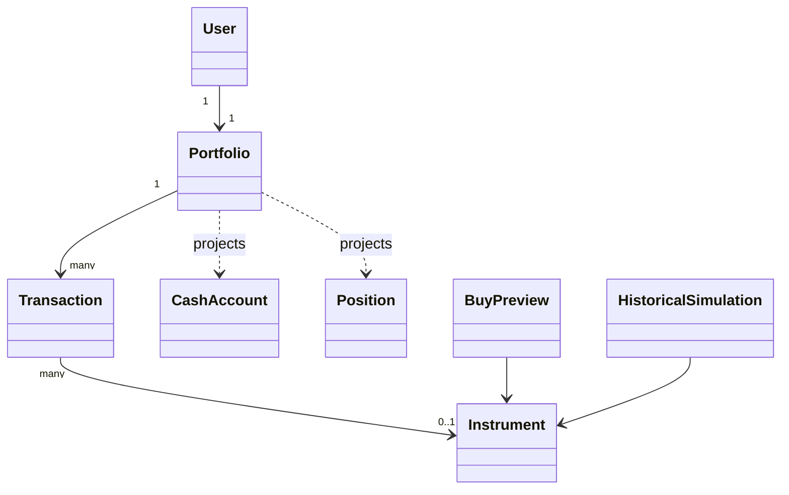

# Modelo de dominio

## Lenguaje ubicuo

- **Ledger:** secuencia inmutable de movimientos autoritativos.
- **Saldo disponible:** créditos de efectivo menos débitos y fees.
- **Posición:** proyección de transacciones de un instrumento, no una entidad mutable.
- **Sesión efectiva:** día de mercado del precio realmente usado.
- **Preview:** cotización calculada por servidor y temporalmente confirmable.
- **Base de precio:** `UNADJUSTED_CLOSE` o `ADJUSTED_CLOSE` con semántica declarada.

## Value objects

| Tipo         | Contenido e invariantes                                                                         |
| ------------ | ----------------------------------------------------------------------------------------------- |
| `Currency`   | ISO 4217; el MVP opera `COP` como única moneda y el tipo de dominio la restringe a ese literal. |
| `Money`      | decimal con moneda, escala máxima 2, magnitud dentro de `numeric(24,2)`.                        |
| `Quantity`   | decimal positivo o cero, escala máxima 8.                                                       |
| `UnitPrice`  | decimal estrictamente positivo, moneda y escala máxima 8.                                       |
| `Percentage` | decimal; nullable cuando el denominador es cero.                                                |
| `MarketDate` | fecha ISO `YYYY-MM-DD`, sin hora.                                                               |
| `Instant`    | timestamp UTC de ejecución u obtención.                                                         |
| IDs          | `UserId`, `PortfolioId`, `InstrumentId`, `TransactionId`, `PreviewId`; no intercambiables.      |

Reglas: cálculos con 50 dígitos significativos; cantidad `ROUND_DOWN` a ocho decimales; dinero `ROUND_HALF_UP` a dos. En HTTP se serializan como strings. No se acepta una entrada con escala excesiva: no se redondea silenciosamente.

## Entidades y aggregates

### User

Identidad propietaria. En el MVP existe un usuario local fijo detrás de `CurrentUserProvider`. No contiene lógica de autenticación.

### Portfolio (aggregate root)

Tiene ID, owner, moneda base COP, timestamps y movimientos. Invariantes:

- exactamente un `INITIAL_DEPOSIT` de COP 10.000.000;
- ninguna secuencia válida deja efectivo negativo;
- solo acepta compras de instrumentos activos `Equity` en COP;
- los movimientos existentes nunca se editan o eliminan;
- la confirmación idempotente no agrega movimientos duplicados.

### CashAccount

Concepto dentro del aggregate, derivado del ledger. No almacena `currentBalance` como verdad. Para la secuencia soportada:

```text
cash = Σ INITIAL_DEPOSIT.grossAmount − Σ (BUY.grossAmount + BUY.fees)
```

### Instrument

Entidad de referencia: `id`, `symbol`, `name`, `exchange`, `currency`, `type`, `status`. Tipos extensibles: `EQUITY`, `ETF`, `FIXED_INCOME`, `FUND`, `INDEX`, `CURRENCY`; solo `EQUITY` se implementa. Estado: `ACTIVE`, `INACTIVE`, `UNAVAILABLE`. Símbolo no funciona como identidad global.

### Transaction

Movimiento inmutable:

```text
id, portfolioId, type, instrumentId?, quantity?, unitPrice?,
grossAmount, fees, currency, executedAt, marketSessionDate?,
source, idempotencyKey?, createdAt, ledgerSequence, marketData?
```

`ledgerSequence` es el orden de append autoritativo del ledger (ADR-0003): el proyector lo usa como desempate cuando `executedAt`/`createdAt` coinciden. El `BUY` conserva la metadata completa del mercado usado (`marketData`) y la clave de idempotencia que lo produjo.

Tipos conceptuales: `INITIAL_DEPOSIT`, `BUY`, `SELL`. Para depósito, instrumento/cantidad/precio son nulos. Para compra son obligatorios y `grossAmount = roundMoney(quantity × unitPrice)`. `SELL` está reservado y se rechaza hasta tener requirement y política de costo aprobados.

`source` distingue `SYSTEM_INITIALIZATION` y `USER_SIMULATION`. Una compra
conserva además `marketData` inmutable (`providerId`, `mode`, `priceBasis`,
`retrievedAt`) y la sesión de mercado usada; así el ledger preserva la
procedencia y base del precio sin convertirlas en texto libre dentro de
`source`.

### BuyPreview

Entidad temporal con intención, precio, cantidad, importe efectivo, remanente del monto solicitado, fees, débito total, metadata de mercado, creación, vencimiento y estado `ACTIVE | CONSUMED | EXPIRED`. Expira exactamente cinco minutos después de crearse según reloj inyectado. Se persiste por portafolio con precio y metadata inmutables; la confirmación bloquea el portafolio, verifica vigencia y fondos, consume la preview y agrega el `BUY` en una sola transacción. Semántica de idempotencia: la misma clave sobre esa preview devuelve su resultado original; la misma clave sobre otra preview es `IDEMPOTENCY_CONFLICT`; una preview ya consumida con otra clave es `PREVIEW_ALREADY_USED`.

## Proyecciones

### Position

Derivada por instrumento: cantidad, costo invertido, costo promedio, precio actual y fecha, valor, P&L y retorno. En el MVP, costo = suma de compras y no hay ventas. Estado `VALUED`, `PRICE_UNAVAILABLE` o `CORPORATE_ACTION_UNSUPPORTED`.

```text
marketValue = roundMoney(quantity × currentPrice)
pnl = marketValue − cost
returnPct = pnl / cost × 100
```

Si falta valoración, los campos dependientes son nulos y el portafolio total también se marca incompleto.

### PortfolioSnapshot

Efectivo, inversión/costo, valor de posiciones, valor total, P&L, retorno, posiciones y `valuationStatus`. El retorno del portafolio usa depósito inicial como denominador. Con denominador cero devuelve `null`/«no aplica».

## Servicios de dominio

### PurchaseCalculator

Entrada: monto solicitado y precio. Calcula cantidad hacia abajo a 8 decimales, `grossAmount` a 2, remanente = solicitado − grossAmount, fees y débito. Rechaza resultado con cantidad o grossAmount cero. El remanente permanece en efectivo y no forma parte del débito.

### PortfolioProjector

Reproduce el ledger en orden autoritativo de append (`ledger_sequence`), con `executedAt`/`createdAt`/`id` como desempates secundarios; valida la secuencia y deriva efectivo y posiciones. Una secuencia corrupta retorna un error explícito, no una proyección parcial silenciosa.

### HistoricalInvestmentCalculator

Parámetros: instrumento, Money inicial, fecha solicitada inicial/final y base. Resultado: fechas y precios efectivos, cantidad teórica, remanente, valor final, P&L, retorno, evolución, procedencia y supuestos.

```text
quantity = floor8(initialAmount / initialPrice)
invested = roundMoney(quantity × initialPrice)
remainder = initialAmount − invested
finalValue = roundMoney(quantity × finalPrice) + remainder
pnl = finalValue − initialAmount
returnPct = pnl / initialAmount × 100
```

No persiste ni emite transacciones. Toda la serie usa la misma moneda y base de precio.

## Puertos de aplicación

- `PortfolioRepository`: inicialización idempotente, lectura del ledger y append atómico.
- `BuyPreviewRepository`: guardar, bloquear y consumir previews.
- `MarketDataProvider`: instrumentos, precios y series.
- `Clock`: instante UTC determinista.
- `CurrentUserProvider`: usuario efectivo reemplazable.
- `StructuredLogger`: eventos categorizados sin acoplar el dominio.

## Errores de dominio

`INVALID_MONEY`, `INVALID_SCALE`, `INSTRUMENT_NOT_TRADABLE`, `CURRENCY_MISMATCH`, `PORTFOLIO_NOT_INITIALIZED`, `INSUFFICIENT_FUNDS`, `PREVIEW_EXPIRED`, `PREVIEW_ALREADY_USED`, `IDEMPOTENCY_CONFLICT`, `INVALID_QUERY`, `MARKET_DATA_UNAVAILABLE`, `NO_MARKET_SESSION`, `UNSUPPORTED_PRICE_BASIS`, `CORPORATE_ACTION_UNSUPPORTED`, `CORRUPT_LEDGER`. Los errores del proveedor de mercado (`INSTRUMENT_NOT_FOUND`, `NO_MARKET_DATA`, `INVALID_DATE_RANGE`, `COVERAGE_INSUFFICIENT`, `INVALID_PROVIDER_DATA`, `PROVIDER_UNAVAILABLE`, `RATE_LIMITED`) se definen en el [contrato de datos de mercado](../data/market-data-contract.md).

Los errores son resultados tipados o excepciones de dominio controladas; los adapters HTTP los traducen sin filtrar detalles internos.

## Relaciones


